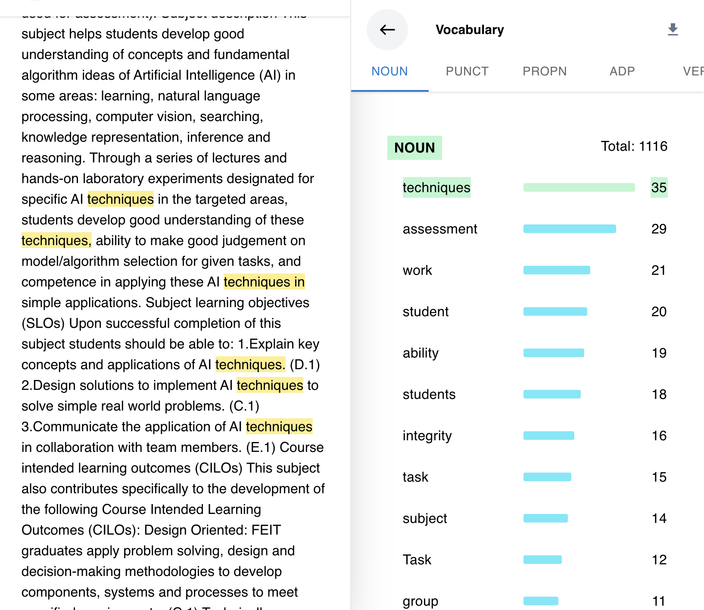
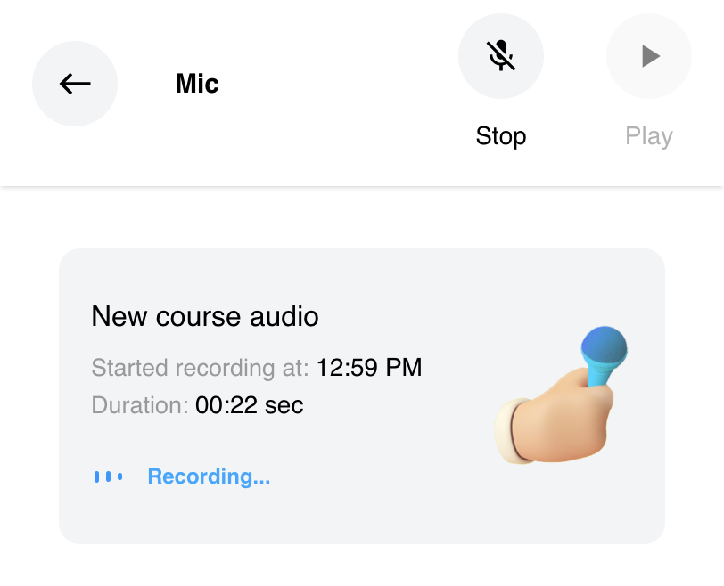
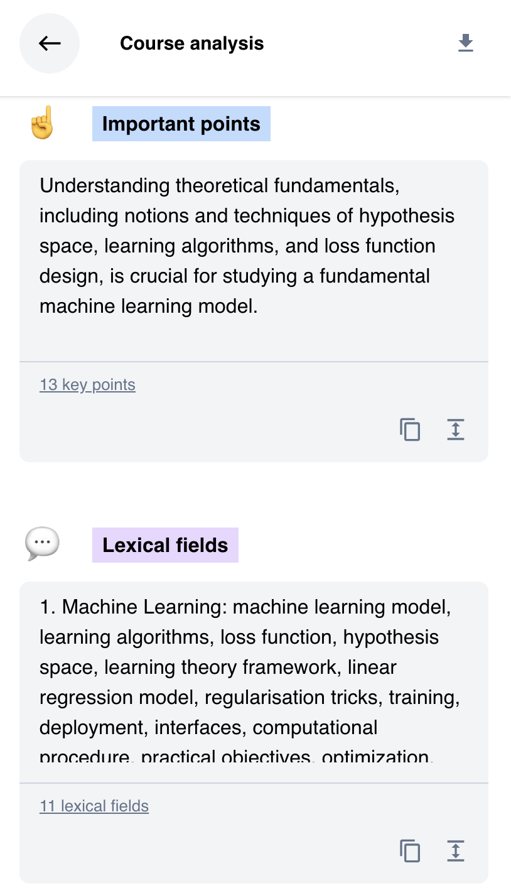
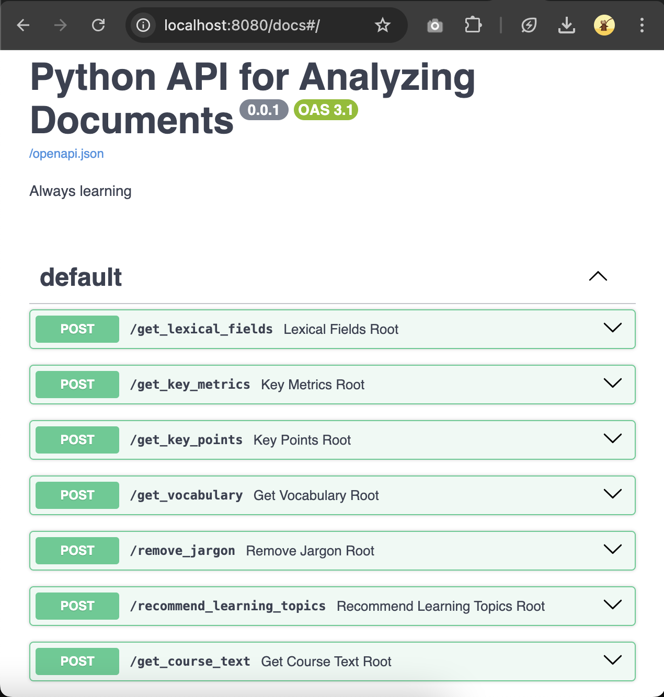

  

# Document Processing AI App - Created in October 2023

This project is a full-stack application I designed to help students study. It is AI-powered and demonstrates my ability to build both an API and a User Interface.

The app supports analyzing university courses and summarizing their content into separate sections. Students can upload various types of documents (e.g., PDF, audio, video) and can also record lectures directly through their browser.

## Table of Contents
1. [Tech Stack](#1-tech-stack)
   - [Backend](#11-backend)
   - [Frontend](#12-frontend)
2. [Frontend Overview](#2-frontend-overview)
   - [Real-time Document Highlight](#21-real-time-document-highlight)
   - [File Inputs](#22-file-inputs)
   - [Interactive Components](#23-interactive-components)
3. [Demo](#3-demo)
4. [Backend Overview](#4-backend-overview)

## 1. Tech Stack

The API and frontend were built from scratch using the following technologies:

### 1.1. Backend
- FastAPI
- Python
- LLMs
- spaCy for NLP

### 1.2. Frontend
- React
- Redux
- TailwindCSS

## 2. Frontend Overview

The frontend allows users to upload files and visualize the content with dynamic elements.

### 2.1. Real-time Document Highlight

Students receive a detailed breakdown of all the vocabulary in the document. The app shows the word types, their frequency, and locations, and even highlights the words in real-time when the user hovers over them.

> The word “techniques” is highlighted in real time in the document.

### 2.2. File Inputs

The app allows users to upload lecture documents, view their file metadata, and supports audio recording.

> A student records his course from the application.

### 2.3. Interactive Components

All information is organized into sections that users can easily interact with. Each section contains:
- The quantity of information (e.g., "11 lexical fields")
- A shortcut to copy the content
- The ability to expand or minimize the text content
- A unique color and icon for easy identification

> The app displays key points and lexical fields extracted from the document.

## 3. Demo

Take a look at the app’s functionality in action:

> The user interacts with a document whose content has been analyzed.

## 4. Backend Overview

The backend has multiple endpoints:

- `/get_lexical_fields`: Extracts lexical fields and their associated words.
- `/get_key_metrics`: Identifies key metrics like dates and figures.
- `/get_key_points`: Summarizes critical knowledge from the text.
- `/get_vocabulary`: Provides an interactive breakdown of the text's vocabulary.
- `/remove_jargon`: Simplifies text by removing unnecessary terms.
- `/recommend_learning_topics`: Suggests key topics based on the text.
- `/get_course_text`: Extracts text from any document.

Below is a snapshot of the API documentation:

